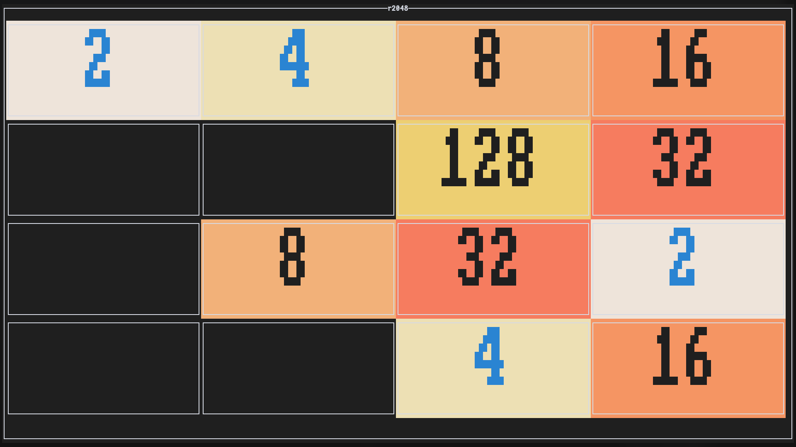

# r2048

<p align="center">
  
</p>

Ever found yourself mindlessly sliding tiles on your phone during a boring meeting? Well, now you can do it in your terminal like a true developer! **r2048** is my take on the addictive number-sliding puzzle game, rebuilt from scratch in Rust with a beautiful TUI.

This isn't just another 2048 clone – it's a love letter to both the classic game and the terminal. Built with Rust's blazing-fast performance and the elegant [`ratatui`](https://github.com/ratatui-org/ratatui) library, it delivers that satisfying slide-and-merge gameplay with colors so crisp you'll forget you're in a terminal.

---

## See It For Yourself

<p align="center">
  <br>
  <em>This is what you are greeted with on the main menu</em>
</p>
<p align="center">
  <br>
  <em>The heat of battle – every move counts when you're this close to 2048</em>
</p>
<p align="center">
  <br>
  <em>Sweet victory! That 2048 tile never gets old</em>
</p>
<p align="center">
  <br>
  <em>Sometimes the numbers just don't align. Time to try again!</em>
</p>

---

## Controls That Just Make Sense

### Main Menu
- `←` / `→` – Browse your options like a pro
- `E` – Dive into the action
- `Q` or `Esc` – Exit the game gracefully

### In the Game
- `↑` / `↓` / `←` / `→` – Slide those tiles with precision
- `Q` or `Esc` – Takes you back to the menu when things get tough
- `Ctrl + C` – Nuclear option (closes everything immediately)

---

### Thoughts On The Project

**Coming from C++**: I have some background in C++, so I wasn't a stranger to manual memory management and low-level thinking. That said, Rust still made me rethink how I structure code. The compiler was strict — but fair — and once I started to **work with** the borrow checker instead of around it, everything became more intuitive.

**Fighting the Borrow Checker**: Like most Rust beginners, I had a few battles with ownership and lifetimes. But once I grasped the model, it actually helped me reason more clearly about game state transitions and data flow. Rust really rewards disciplined design.

**State Management**: Thanks to Rust’s enums and pattern matching, implementing a robust state machine felt natural. Each state (`Menu`, `Playing`, `Won`, `GameOver`) had clearly defined responsibilities, and the compiler helped enforce separation between them. I didn’t just write logic — I encoded game rules into the type system.

**Game Logic Challenges**: On paper, 2048 seems straightforward. But implementing merge rules correctly (especially avoiding double merges) and tracking win/loss conditions taught me a lot about edge cases. I rewrote the move algorithm multiple times before it felt solid.

**Terminal Magic**: Using [`ratatui`](https://github.com/ratatui-org/ratatui) showed me that terminal UIs can be surprisingly expressive. With smooth rendering and full color support, the game feels lively — even in a text-based environment.

---

### Technical Decisions

- **Why Rust?** Rust combines performance with safety. It gave me C++-like control without the footguns. Pattern matching and enums made the game logic more expressive and less error-prone.
  
- **Why Terminal?** Terminal games are pure, portable, and nostalgic. No rendering engines or window managers to worry about — just text and logic. It also made the game extremely lightweight and fast to run.

- **Why Ratatui?** [`ratatui`](https://github.com/ratatui-org/ratatui) gave me full control over layout, styling, and drawing while remaining easy to use. It supports Unicode, colors, and composable layouts — everything I needed for a clean grid-based game like 2048.


## Getting Started

First, make sure you have Rust installed on your system. If not, grab it from [rust-lang.org](https://www.rust-lang.org/tools/install) – it's surprisingly painless.

```bash
# Clone the repo
git clone https://github.com/asaft29/r2048.git

cd r2048

# Run it immediately (Cargo will handle the build)
cargo run --release
```

### System Requirements

- Any terminal with Unicode support (so basically any terminal from the last decade)
- Rust 1.70+ (for the latest `ratatui` features)
- About 2MB of disk space
- A burning desire to reach 2048

---

## What's Next?

Some ideas I'm considering for future versions:
- **Undo functionality** (because we all make mistakes)
- **Different board sizes** (n×n is the plan)
- **High score tracking** (with proper persistence)

---

## Contributing

Found a bug? Have a cool feature idea? Want to improve the colors? Pull requests are welcome! This project is as much about learning Rust and terminal UI development as it is about the game itself.

Whether you're a Rust expert or another beginner like me, I'd love to see what improvements you can bring to the table.

---

## Bibliography & Credits

<p align="center">

- <b>Figlet Fonts</b>  
Fonts used in ASCII art are from the collection by <a href="https://github.com/xero" target="_blank">xero</a>  
<br>

- <b>Ratatui</b>  
Built with the powerful terminal UI library <a href="https://ratatui.rs/" target="_blank">ratatui.rs</a>  
</p>

--- 


