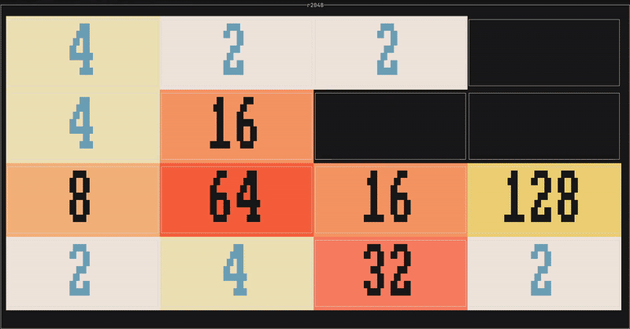
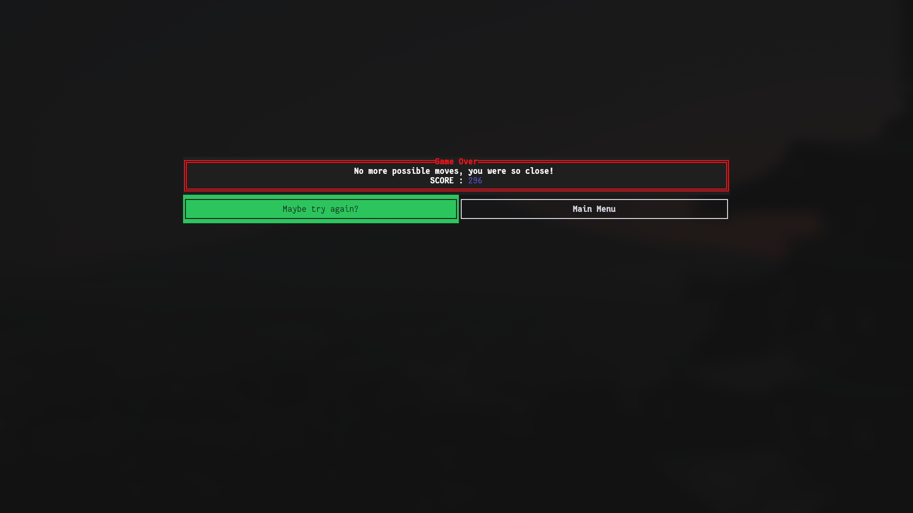

# r2048
[](https://github.com/asaft29/r2048/actions/workflows/linux.yml)
[](https://github.com/asaft29/r2048/actions/workflows/macos.yml)
[](https://github.com/asaft29/r2048/actions/workflows/windows.yml)
[](https://crates.io/crates/r2048)
<p align="center">
  <br><br>
  r2048 is a terminal version of the classic 2048 game, built in Rust using the <a href="https://github.com/ratatui-org/ratatui">ratatui</a> crate for the UI design.
</p>


## Preview
<br>

<p align="center">
  <br>
  <strong>Menu</strong>
</p>
<p align="center">
  <br>
  <strong>Mid-game</strong>
</p>
<p align="center">
  <br>
 ʕ·͡ᴥ·ʔ <strong>Winning</strong> ʕ·͡ᴥ·ʔ
</p>
<p align="center">
  <br>
  ಡ_ಡ <strong>Losing</strong> ಡ_ಡ
</p>

<br>

## Controls That Just Make Sense

### Main Menu
- `←` / `→` – Browse your options like a pro
- `E` – Dive into the action
- `Q` or `Esc` – Exit the game gracefully

### In the Game
- `↑` / `↓` / `←` / `→` – Slide those tiles with precision
- `Q` or `Esc` – Takes you back to the menu when things get tough
- `Ctrl + C` – Nuclear option (closes everything immediately)

<br>

## Score Persistence 

High scores now persist between sessions thanks to a built-in [SQLite](https://docs.rs/rusqlite/latest/rusqlite/) database.

Whether you quit the game, close your terminal, or reboot your machine, your top scores are safely stored — no setup required.

Each user has a separate score history, so you can challenge friends on the same machine without stepping on each other’s records. It’s simple, fast, and completely local.

<br>

## Development Notes

- **C++ Background:** Coming from C++, Rust’s borrow checker encouraged cleaner, safer code structure.  

- **State Machine:** Using enums and pattern matching, the game’s states (`Menu`, `Playing`, `Won`, `GameOver`) are clear and type-safe.  

- **Game Logic:** Implementing merge rules correctly without double merges was the trickiest part — it took several rewrites to get right.  
ker encouraged 
- **Code Quality:** Rust’s strictness helped catch subtle edge cases and improved overall code reliability.

<br>

## Getting Started

### 1. Via [crates.io](https://crates.io/crates/r2048):
If Rust is installed and you don't want to clone the repo, consider using `cargo install`
```bash
cargo install r2048

r2048
```

### 2. Build it yourself

First, make sure you have Rust installed on your system. If not, grab it from [rust-lang.org](https://www.rust-lang.org/tools/install) – it's surprisingly painless.

```bash
# Clone the repo
git clone https://github.com/asaft29/r2048.git

cd r2048

# Run it immediately with no verbose output showing (Cargo will handle the build)
cargo run --release 
```

### Warning

> There are some potential issues with `cargo install` if you are on **Windows**  

- `stdarg.h` missing → install C++ build tools + Windows SDK  
- `libsqlite3-sys` fails → MSVC headers required
